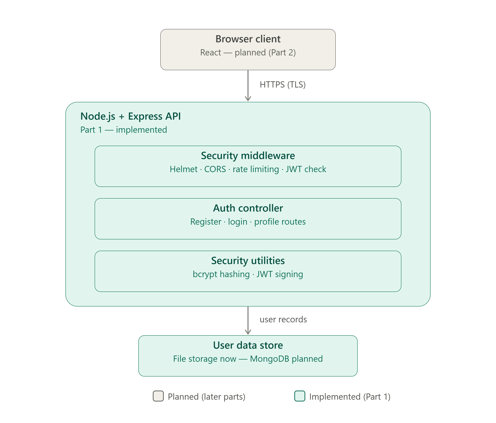

# HustleHub+

Secure freelance marketplace platform developed for INSY7214 (Secure Freelance Marketplace POE).

## Project Overview

HustleHub+ is a secure freelance marketplace platform that allows **Freelancers** to advertise services and **Clients** to browse and book those services. The system will support creation of transaction records based on bookings (payments are simulated), income tracking for Freelancers, and estimated tax calculations.

The platform is being built with security treated as a core requirement rather than an afterthought, since it will process sensitive information including user credentials, transactional records, and income-related data.

### Intended Users

| Role | Description |
|---|---|
| **Client** | Browses and books services offered by Freelancers |
| **Freelancer** | Advertises services (gigs), manages bookings, tracks income and estimated tax |
| **Admin** | System administration and oversight |

Part 1 establishes the foundation these roles will sit on top of: secure registration, login, and token-based identification. Role-based access control itself (restricting specific endpoints per role) is scoped for a later part of the project.

## Development Approach

This project follows an incremental development approach across three parts:

- **Part 1 — Secure backend foundations** *(current)*
- Part 2 — Full-stack application development
- Part 3 — DevSecOps, monitoring, and finalisation

## Technology Stack

### Frontend
- React

### Backend
- Node.js
- Express.js

### Database
- MongoDB *(Part 1 uses in-memory/file-based user storage; MongoDB integration is planned for a later part)*

### Security
- JWT (JSON Web Tokens)
- bcrypt password hashing
- Input validation (express-validator)
- HTTPS (locally configured SSL certificate)
- Rate limiting on authentication routes
- Role-based access control *(foundation in place, enforcement expands in later parts)*

### DevOps
- Docker
- GitHub Actions
- Automated testing
- Security scanning

*(The DevOps and role-enforcement items above are part of the overall project scope and will be implemented in later parts, not Part 1.)*

## Backend Structure

```
backend/
└── src/
    ├── app.js                       — Express app setup (middleware, routes)
    ├── server.js                    — HTTPS server entry point
    ├── config/
    │   ├── env.js                   — loads & validates required environment variables
    │   ├── httpsConfig.js           — loads the local SSL certificate/key
    │   └── logger.js                — Winston logging configuration
    ├── constants/
    │   └── roles.js                 — CLIENT / FREELANCER / ADMIN role definitions
    ├── controllers/
    │   └── authController.js        — registration, login, profile logic
    ├── middleware/
    │   ├── authMiddleware.js        — verifies JWT on protected routes
    │   ├── validationMiddleware.js  — validates & sanitises auth input
    │   ├── errorHandler.js          — centralised, safe error responses
    │   └── asyncHandler.js          — wraps async routes for consistent error handling
    ├── models/
    │   └── userModel.js             — user data (in-memory/file storage for Part 1)
    ├── routes/
    │   └── authRoutes.js            — /api/auth/* endpoint definitions
    └── utils/
        ├── AppError.js              — custom error class for controlled error responses
        ├── jwt.js                   — token signing & verification helpers
        └── password.js              — bcrypt hashing & comparison helpers
```

This separates concerns cleanly: routes define *what* endpoints exist, controllers define *what happens* when they're called, middleware handles cross-cutting checks (validation, auth, errors) before a request reaches business logic, and models represent the data itself.

## API Endpoints (Part 1)

| Method | Endpoint | Description | Auth required |
|---|---|---|---|
| GET | `/health` | Basic health check | No |
| POST | `/api/auth/register` | Register a new user | No |
| POST | `/api/auth/login` | Log in and receive a JWT | No |
| GET | `/api/auth/profile` | Get the logged-in user's profile | Yes (JWT) |

## Security Decisions

### Password Hashing

Passwords are never stored in plain text. On registration, passwords are hashed using **bcrypt** before being saved. Bcrypt is a deliberately slow, salted hashing algorithm — the salt means two users with the same password get different hashes, and the slowness makes brute-force and rainbow-table attacks impractical even if the stored data were ever exposed. On login, the submitted password is compared against the stored hash using bcrypt's own comparison function — the plain-text password itself is never stored or logged at any point.

### Token-Based Authentication (JWT)

After a successful login, the API issues a **JSON Web Token** signed with a secret key. This token is returned to the client and must be included as a `Bearer` token in the `Authorization` header on subsequent requests to protected routes (such as `/api/auth/profile`). The `authMiddleware` verifies the token's signature and expiry on every protected request before allowing it through — an invalid, expired, or missing token is rejected with a `401 Unauthorized` response. This means the server doesn't need to keep session state in memory; authentication is stateless and scales naturally as the system grows.

### Input Validation

All incoming data on the registration and login endpoints is validated before it reaches any business logic, using `express-validator`. This includes checking email format and enforcing password strength requirements on registration. Invalid or malformed input is rejected immediately with a `400 Bad Request` response, before it gets anywhere near the user store — this stops malformed or malicious input from being processed at all, rather than relying on something further down the chain to catch it.

### HTTPS

The API is served over **HTTPS** using a locally generated SSL certificate. All traffic between client and server — including login credentials and JWTs — is encrypted in transit. Without HTTPS, credentials and tokens sent over plain HTTP could be intercepted by anyone on the same network (a man-in-the-middle attack), which is unacceptable for a system handling authentication and, eventually, financial data.

### Controlled Error Handling

Errors are caught centrally by `errorHandler.js` and returned as clean, generic JSON responses (e.g. `{ "success": false, "message": "Invalid email or password" }`). Internal details — stack traces, file paths, database errors, configuration values — are never exposed to the client. As one specific example: login failures return the *same* generic message and status code whether the email doesn't exist or the password is wrong, which prevents an attacker from using the login endpoint to figure out which emails are registered on the system.

## Getting Started

Each team member needs their own local `.env` file and SSL certificate — these are intentionally excluded from the repository via `.gitignore` so no secrets are ever committed.

```bash
git clone https://github.com/ST10266958/INSY7314-HustleHub.git
cd INSY7314-HustleHub
git checkout <your-branch>
cd backend
npm install
```

**Create your local environment file:**

```bash
cp .env.example .env
```

Fill in a value for `JWT_SECRET` (any string works for local development — this is never deployed or submitted).

**Generate a local SSL certificate:**

```bash
mkdir certificates
openssl req -x509 -newkey rsa:2048 -keyout certificates/privatekey.pem -out certificates/certificate.pem -days 365 -nodes -subj "/CN=localhost"
```

**Run the server:**

```bash
npm run dev
```

Visit `https://localhost:5000/health` to confirm it's running (your browser will warn about the self-signed certificate — this is expected for local development, proceed past it).

## Testing

All Part 1 endpoints were tested using Postman. The full collection — covering successful registration and login, as well as invalid, missing, duplicate, and unauthorised scenarios — is included at [`backend/postman/HustleHub-Part1.postman_collection.json`](backend/postman/HustleHub-Part1.postman_collection.json).

Full test case documentation, including expected vs. actual results and notes on the security-specific tests, is available at [`backend/docs/part1-testing.md`](backend/docs/part1-testing.md).

## References

A full reference list covering the technologies, libraries, and security guidance used in this build is available at [`backend/docs/references.md`](backend/docs/references.md)

### Architecture Diagram

See below for a visual overview of how a request flows through the system — from the client, over HTTPS, through the security middleware, into the auth controller, and down to the data store.



## Team

| Member | Role |
|---|---|
| Andisa | Team Lead / Backend & Integration |
| Mel | Security & Authentication |
| Gia | Testing & Documentation |

## Project Status

**Part 1 — Secure Backend Foundations: Complete**

- ✅ Express API with modular route/controller/middleware structure
- ✅ HTTPS configured and running locally
- ✅ Registration & login with bcrypt password hashing
- ✅ JWT issued on login, verified on protected routes
- ✅ Input validation on all auth endpoints
- ✅ Centralised, safe error handling
- ✅ Postman collection and test documentation