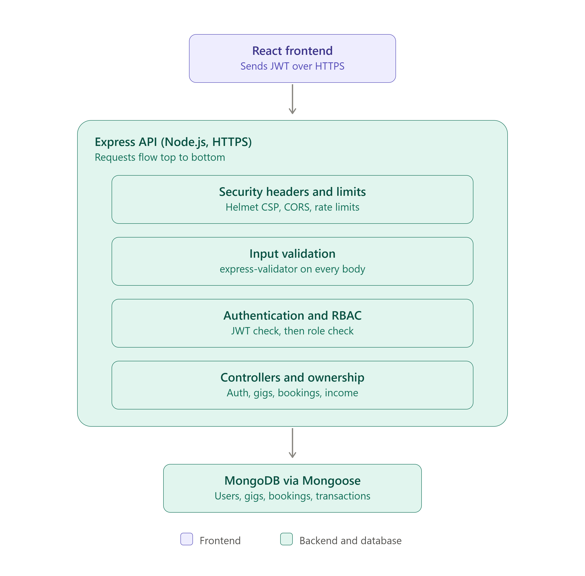

# HustleHub+

Secure freelance marketplace platform developed for INSY7214 (Secure Freelance Marketplace POE).

## Project Overview

HustleHub+ is a full-stack MERN application where **Freelancers** list services (gigs) and **Clients** browse and book them. Payments are simulated: every booking is confirmed immediately and creates a transaction record linked to both the client and the freelancer. The system tracks each freelancer's income from their bookings.

Security is treated as a core requirement. The platform handles user credentials and transaction records, so authentication, authorisation, input validation, rate limiting and security headers are applied across both the API and the frontend.

### Intended Users

| Role | Description |
|---|---|
| **Client** | Browses gigs, books them, and views their own bookings |
| **Freelancer** | Creates and manages their own gigs, views bookings made against them, and tracks income |
| **Admin** | Role is defined in the system but cannot be self-registered. No admin-only endpoints exist yet. |

## Development Approach

The project is built incrementally across three parts:

- **Part 1 — Secure backend foundations** *(complete)*: Express API, HTTPS, registration, login, bcrypt hashing, JWT, validation
- **Part 2 — Secure stack** *(current)*: MongoDB, gig management, bookings, transactions, income tracking, role-based access control, React frontend, security headers and CSP, Newman and frontend testing
- Part 3 — DevSecOps, monitoring and finalisation

## Features

- **Authentication:** register as a client or freelancer, log in, and receive a JWT
- **Gig management:** freelancers create, update, activate/deactivate and delete their own gigs. Anyone can browse active gigs.
- **Bookings:** clients book a gig and get a simulated confirmation. Every booking creates a transaction record associated with the client and the freelancer.
- **Income tracking:** freelancers see their total income and number of completed bookings
- **Role-based access control:** each endpoint is restricted by role, and users can only modify or delete resources they own
- **React frontend:** public gig browsing, registration and login, client booking flow and booking history, and a freelancer dashboard (own gigs, bookings, income)

## Architecture

```
React frontend (Vite, http://127.0.0.1:5173)
        │   HTTPS, Authorization: Bearer <JWT>
        ▼
Express API (https://localhost:5000)
   Helmet + CSP → CORS → JSON body limit → rate limiter → input validation
   → JWT authentication → role check (RBAC) → controller (ownership check)
        │
        ▼
MongoDB via Mongoose: users, gigs, bookings, transactions
```

### Architecture diagram



## Technology Stack

| Layer | Technology |
|---|---|
| Frontend | React 18, React Router 6, Vite |
| Backend | Node.js, Express 5 |
| Database | MongoDB (Atlas), Mongoose |
| Security | JWT, bcrypt, express-validator, Helmet (CSP), express-rate-limit, CORS, HTTPS |
| Testing | Postman and Newman (backend), Jest and React Testing Library (frontend) |
| Planned (Part 3) | Docker, GitHub Actions, automated security scanning |

## Project Structure

```
backend/
├── src/
│   ├── app.js                    Express app: security middleware, routes
│   ├── server.js                 Connects to MongoDB, then starts the HTTPS server
│   ├── config/                   env.js, db.js, httpsConfig.js, logger.js
│   ├── constants/                roles.js, bookingStatus.js
│   ├── controllers/              auth, gig, booking, income
│   ├── middleware/               authMiddleware (JWT), rbacMiddleware (roles),
│   │                             validationMiddleware, errorHandler, asyncHandler
│   ├── models/                   User, Gig, Booking, Transaction (Mongoose)
│   ├── routes/                   authRoutes, gigRoutes, bookingRoutes, incomeRoutes
│   └── utils/                    AppError, jwt, password
├── postman/                      Postman collections and Newman output
├── docs/                         Testing documentation, references, diagram
└── screenshots/                  Test evidence

frontend/
├── src/
│   ├── App.jsx, main.jsx         App shell and routes
│   ├── api.js, config.js         API client and API URL
│   ├── auth.jsx, components.jsx  Auth context, route guards, shared components
│   ├── pages/                    AuthPage, Gigs, GigDetail, Dashboard, Bookings
│   └── test/                     Test setup and CSP tests
├── csp.js, vite.config.js        Content Security Policy headers and Vite config
└── docs/                         Frontend testing and CSP documentation, evidence
```

## API Endpoints

Base URL: `https://localhost:5000`. All protected routes need `Authorization: Bearer <token>`.

| Method | Endpoint | Access | Description |
|---|---|---|---|
| GET | `/health` | Public | Health check |
| POST | `/api/auth/register` | Public | Register as a client or freelancer |
| POST | `/api/auth/login` | Public | Log in and receive a JWT |
| GET | `/api/auth/profile` | Any logged-in user | Current user's profile |
| GET | `/api/gigs` | Public | List active gigs |
| GET | `/api/gigs/:id` | Public | Get one gig |
| GET | `/api/gigs/mine` | Freelancer | List your own gigs |
| POST | `/api/gigs` | Freelancer | Create a gig |
| PUT | `/api/gigs/:id` | Freelancer (owner) | Update a gig |
| DELETE | `/api/gigs/:id` | Freelancer (owner) | Delete a gig |
| POST | `/api/bookings` | Client | Book a gig; also creates a transaction |
| GET | `/api/bookings/client` | Client | Your bookings as a client |
| GET | `/api/bookings/freelancer` | Freelancer | Bookings made against your gigs |
| GET | `/api/income` | Freelancer | Your total income and completed bookings |

## Security Measures

### Password hashing
Passwords are hashed with bcrypt (12 salt rounds by default) before storage and are never stored or logged in plain text. Registration enforces 8 to 128 characters with at least one lowercase letter, one uppercase letter and one number.

### JWT authentication
Login returns a signed JWT with an expiry (1 hour by default). Every protected route passes through `authMiddleware`, which verifies the signature and expiry. Missing, malformed, wrongly signed and expired tokens are all rejected with `401`, and none of the messages reveal how the token is built.

### Role-based access control and ownership
`rbacMiddleware` restricts each route to specific roles and runs before the controller. A role mismatch returns `403`.

| Action | Client | Freelancer | Not logged in |
|---|---|---|---|
| Browse gigs | Yes | Yes | Yes |
| Create, update, delete gigs | No (403) | Own gigs only | No (401) |
| Create a booking | Yes | No (403) | No (401) |
| View own bookings | Client view | Freelancer view | No (401) |
| View income | No (403) | Yes | No (401) |

Ownership is enforced in the controller. Editing or deleting a gig you do not own returns `404 Gig not found`, the same response as a gig that does not exist, so error messages cannot be used to discover which gig ids belong to other users. Registration only accepts the `client` and `freelancer` roles, so a user cannot create an admin account.

### Input validation and sanitisation
All request bodies are validated with express-validator before reaching any controller: email format (normalised), password strength, gig field types and length limits, price as a number, `isActive` as a boolean, and booking `gigId` as a valid MongoDB id. Values must be the expected type, so object payloads such as `{"$ne": null}` are rejected with `400` before any database query runs. JSON bodies are limited to 10 KB. On the frontend, React escapes all rendered text and the UI never injects user-supplied HTML.

### Rate limiting
Limits are applied per IP address.

| Endpoints | Limit |
|---|---|
| `POST /api/auth/register`, `POST /api/auth/login` | 20 requests per 15 minutes |
| `POST /api/bookings` | 30 requests per 15 minutes |

Exceeding a limit returns `429` with a clear message.

### Security headers and Content Security Policy
The API uses Helmet with an explicit Content Security Policy (`default-src 'self'`, `script-src 'self'`, `object-src 'none'`, `frame-ancestors 'none'`, and images limited to self and data URLs). The frontend sends its own CSP headers from the Vite dev and preview servers, with a strict production-preview policy. The headers are not part of the static build, so a production host must send them itself. See [`frontend/docs/frontend-csp.md`](frontend/docs/frontend-csp.md).

### HTTPS and CORS
The API runs over HTTPS with a locally generated certificate, so credentials and tokens are encrypted in transit. CORS only allows the configured `CLIENT_ORIGIN`.

### Safe error handling
Errors go through a central handler that returns clean JSON messages. Stack traces, file paths, database errors and configuration values are never sent to the client. Login failures return the same message whether the email or the password was wrong. The frontend maps API errors to readable messages and never shows raw responses.

### Frontend session handling
The JWT is held in React memory only, never in localStorage or sessionStorage, so refreshing the page ends the session. Route guards redirect anonymous and wrong-role users, but they exist for usability only. The real enforcement is on the server.

## Getting Started

Requirements: Node.js 20.19+ or 22.12+, OpenSSL, and a MongoDB database (a free MongoDB Atlas cluster works).

Each team member needs their own `.env` file and SSL certificate. These are excluded from the repository by `.gitignore` so no secrets are committed.

### 1. Clone

```bash
git clone https://github.com/ST10266958/INSY7314-HustleHub.git
cd INSY7314-HustleHub
```

### 2. Backend

```bash
cd backend
npm install
```

Create `backend/.env` (copy `.env.example` and add the missing values):

| Variable | Required | Description |
|---|---|---|
| `MONGODB_URI` | Yes | MongoDB connection string, e.g. `mongodb+srv://<user>:<password>@<cluster>/hustlehub?retryWrites=true&w=majority` |
| `JWT_SECRET` | Yes | Any string for local development |
| `JWT_EXPIRES_IN` | No | Token lifetime, default `1h` |
| `BCRYPT_SALT_ROUNDS` | No | Default `12` |
| `PORT` | No | Default `5000` |
| `CLIENT_ORIGIN` | Yes | Frontend origin allowed by CORS. Set it to `http://127.0.0.1:5173`, the address Vite serves |
| `SSL_KEY_PATH`, `SSL_CERT_PATH` | No | Default `certificates/privatekey.pem` and `certificates/certificate.pem` |

If you use Atlas, create a database user and allow your IP address under Network Access, otherwise the server cannot connect and will not start.

Generate a local SSL certificate:

```bash
mkdir certificates
openssl req -x509 -newkey rsa:2048 -keyout certificates/privatekey.pem -out certificates/certificate.pem -days 365 -nodes -subj "/CN=localhost"
```

Start the API:

```bash
npm run dev
```

You should see "Connected to MongoDB" followed by the HTTPS startup message. Open `https://localhost:5000/health` once and accept the browser's self-signed certificate warning. The frontend cannot reach the API until the certificate is trusted.

### 3. Frontend

In a second terminal:

```bash
cd frontend
npm ci
npm run dev
```

Open **http://127.0.0.1:5173**, the address Vite prints in the terminal. It must match `CLIENT_ORIGIN` in `backend/.env`. The API URL defaults to `https://localhost:5000/api`. To change it, copy `frontend/.env.example` to `frontend/.env`, edit `VITE_API_URL`, and restart Vite.

If the app shows "Cannot reach the API", check that the backend is running, that its certificate is trusted, and that `CLIENT_ORIGIN` matches the address in your browser exactly (`localhost` and `127.0.0.1` count as different origins).

## Testing

### Backend: Postman and Newman

The collection `backend/postman/HustleHub-Part2.postman_collection.json` has 55 requests covering registration and login, gig management as owner, wrong-owner and wrong-role attempts, input validation, bookings and transactions, booking and income views, missing/invalid/expired tokens, and rate limiting.

To run it with Newman (with the API running):

```bash
npm install -g newman
cd backend
newman run postman/HustleHub-Part2.postman_collection.json --insecure
```

`--insecure` is needed because the API uses a self-signed certificate locally. The collection variable `jwtSecret` must match the backend's `JWT_SECRET` (default `secret`), because it is used to sign the expired-token test. Restart the backend before each run so the rate limit counters start at zero.

**Recorded result:** Newman ran 82 requests (the rate limiting test sends a burst of extra booking requests) and checked 115 assertions. 113 passed and 2 failed. The two failing assertions are recorded in [`backend/docs/part2-testing.md`](backend/docs/part2-testing.md).

Evidence: [`backend/postman/newman-output.txt`](backend/postman/newman-output.txt), the screenshots in [`backend/screenshots/`](backend/screenshots/), and the full write-up in [`backend/docs/part2-testing.md`](backend/docs/part2-testing.md).

### Frontend: Jest and React Testing Library

```bash
cd frontend
npm test                 # run the tests
npm run test:coverage    # with coverage
npm run build            # production build
```

36 tests across six suites pass. They cover component rendering, user interaction (login, registration, booking, gig create/edit/delete), route protection, the API client's error handling, and CSP regression checks. API responses are mocked in these tests, so they do not prove a live backend integration. Details and evidence are in [`frontend/docs/part2-frontend-testing.md`](frontend/docs/part2-frontend-testing.md) and `frontend/docs/evidence/`.

### Part 1 testing

The Part 1 collection is at [`backend/postman/HustleHub-Part1.postman_collection.json`](backend/postman/HustleHub-Part1.postman_collection.json), with documentation in [`backend/docs/part1-testing.md`](backend/docs/part1-testing.md).

## Limitations

- There is no standalone transaction history endpoint. A transaction is returned in the response when a booking is created.
- Estimated tax calculations and admin-only features are not implemented in Part 2.
- The frontend session is lost on page refresh by design (see Frontend session handling).

## Demonstration Videos

- **Part 1:** https://youtu.be/7Ul6SDaJ4iQ
- **Part 2:** *(link to be added)*

## References

A full reference list covering the technologies, libraries and security guidance used is available at [`backend/docs/references.md`](backend/docs/references.md).

## Team

| Member | Part 1 | Part 2 |
|---|---|---|
| Andisa | Team Lead, backend foundation and integration | Gig, booking, transaction and income backend, RBAC, security headers, rate limiting, integration |
| Mel | Security and authentication | React frontend and frontend testing |
| Gia | Testing and documentation | Backend security testing, Postman and Newman |

## Project Status

**Part 1 — Secure Backend Foundations: Complete**

**Part 2 — Secure Stack: In progress**

- ✅ MongoDB integration with Mongoose models for users, gigs, bookings and transactions
- ✅ Gig management with ownership enforcement
- ✅ Bookings that create transaction records, and income tracking
- ✅ Role-based access control on all protected routes
- ✅ Input validation, rate limiting, Helmet and Content Security Policy
- ✅ React frontend (browse, register, login, booking, freelancer dashboard)
- ✅ Postman collection and Newman evidence
- ✅ Frontend tests
- ⬜ Part 2 demonstration video